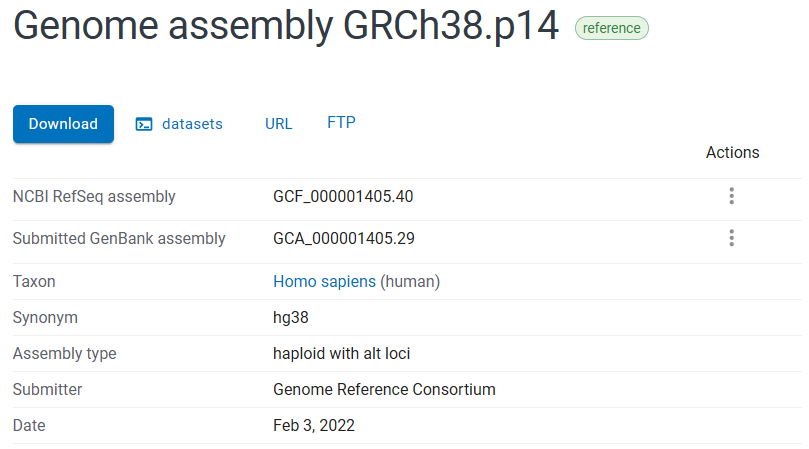

## gRNA数据库构建流程

### 0.数据预处理

参考基因组拆分：将hg38的参考序列按照NC编号拆分为24份

gtf拆分及信息提取：找到coding和uncoding的gene id 列表，只保留在gene id 列表中且包含NM和NR的转录本

脚本路径：[/mnt/ntc_data/wayne/Repositories/CRISPR/process_gtf_app.py](../process_gtf_app.py)

vcf拆分：根据gtf信息过滤snp，同时只保留"CHROM", "POS", "REF", "ALT", "GENEINFO"列

vcf来源 [https://ftp.ncbi.nlm.nih.gov/snp/organisms/human_9606/VCF/](https://ftp.ncbi.nlm.nih.gov/snp/organisms/human_9606/VCF/)

脚本路径：[/mnt/ntc_data/wayne/Repositories/CRISPR/process_vcf.py](../process_vcf.py)

### 1.基因组扫描
在NCBI数据库中获取人类全基因组的正链序列，查找所有 NGG/NAG 和 CCN/CTN 序列，并输出所有 20bp+NGG/NAG 序列和 CCN/CTN+20bp 反向互补序列。同时删除其中guide序列包含连续4个T、包含简并碱基(含N)的gRNA序列。

脚本路径：[/mnt/ntc_data/wayne/Repositories/CRISPR/process_ref_nc.py](../process_ref_nc.py)

基因组序列来源：https://www.ncbi.nlm.nih.gov/datasets/genome/GCF_000001405.40/

<a href="https://www.ncbi.nlm.nih.gov/datasets/genome/GCF_000001405.40/"> <image src="./ref_source.png" width=100% > </image> </a>

<!--  -->

### 2.保留落在基因上的gRNA
将切点落在基因内（即「16bp+Gene+16bp」范围内）的gRNA序列取出

脚本路径：[/mnt/ntc_data/wayne/Repositories/CRISPR/process_border_withid.py](../process_border_withid.py)

### 3.保留落在exon上的gRNA
删除其中gRNA_cut(in_gene) 位置没有落在基因的任何一个Exon上的gRNA序列

脚本路径：[/mnt/ntc_data/wayne/Repositories/CRISPR/filter_intron.py](../filter_intron.py)

### 4.标记top cds
标记其中gRNA_cut(in_chr) 位置落在基因的任意CDS前2/3的gRNA序列，每个CDS分别计算，取并集

脚本路径：[/mnt/ntc_data/wayne/Repositories/CRISPR/cds_mark.py](../cds_mark.py)

### 5.打靶转录本占比
计算每个gRNA每个基因中被打靶的转录本数量和比例

脚本路径：[/mnt/ntc_data/wayne/Repositories/CRISPR/tran_count.py](../tran_count.py)

### 6.RG结尾标记
标记其中guide序列以AG或GG结尾的gRNA序列

脚本路径：[/mnt/ntc_data/wayne/Repositories/CRISPR/ag_end.py](../ag_end.py)

### 6.1.删除PAM为AG的gRNA
脚本路径：[/mnt/ntc_data/wayne/Repositories/CRISPR/filter_pam.py](../filter_pam.py)

### 7.CFD score
进行CFD评分以及ot数记录

Flashfry 建库....

事先拼接fa文件并使用Flashfry跑好cfd的原始结果

脚本路径：[/mnt/ntc_data/wayne/Repositories/CRISPR/score/CFD_Scoring/test/search_ot.py](../score/CFD_Scoring/test/search_ot.py)

过滤原始结果

脚本路径：[/mnt/ntc_data/wayne/Repositories/CRISPR/score/CFD_Scoring/test/filter_ot.py](../score/CFD_Scoring/test/filter_ot.py)

脚本路径：[/mnt/ntc_data/wayne/Repositories/CRISPR/append_score.py](../append_score.py)

### 8.flanking and rs2 score

添加flanking序列 同时使用Azimuth进行 on-target评分

评分工具：Azimuth https://github.com/MicrosoftResearch/Azimuth/blob/master/README.md

注：需要下载适配python3版本的Azimuth

脚本路径：[/mnt/ntc_data/wayne/Repositories/CRISPR/rs2_score.py](../rs2_score.py)

### 9.标记SNP

脚本路径：[/mnt/ntc_data/wayne/Repositories/CRISPR/process_snp.py](../process_snp.py)

### 10.标记UTR

脚本路径：[/mnt/ntc_data/wayne/Repositories/CRISPR/utr_mark.py](../utr_mark.py)

### 10.低分标记

给每个gRNA添加新的名称，名称格式为hSLC16A1[gRNA3975],对CFD score ≤ 0.1的gRNA和RS2 score ≤ 0.3的gRNA进行低分标记

脚本路径：[/mnt/ntc_data/wayne/Repositories/CRISPR/low_mark/low_mark.py](../low_mark.py)

### 11.筛选20个(single db finished)
去掉CFD score ≤ 0.1的gRNA和RS2 score ≤ 0.3的gRNA，每个基因选择20条gRNA。

选取方案：gRNA按照CFD score + RS2 score总分按从高到低进行选取；如果总分相同的情况下，优先选择打靶转录本比例高的gRNA；打靶转录本比例相同的情况下，优先选择CFD score和RS2 score差值较小的gRNA

脚本路径：[/mnt/ntc_data/wayne/Repositories/CRISPR/low_mark/low_mark.py](../low_mark.py)

### 12.generate dual database

1.设置筛选规则

1）在spCas9_Homo(WGS)_gRNA-Gene(KO)数据库中，每个基因按长度平均分为5个区域，每个区域再按分数高低筛选10条gRNA序列（如果总分相同的情况下，优先选择打靶转录本比例高的gRNA；打靶转录本比例相同的情况下，优先选择CFD score和RS2 score差值较小的gRNA），每个基因总共取50条gRNA。如果基因的某个区域不足10条gRNA，则在每个区域都获取完成之后，在基因的全部gRNA中按总分高低补齐50条gRNA；如果基因的gRNA总数不足50条，则将gRNA全部取出。

2）将gRNA序列进行gRNA pair组合，穷尽所有组合，对所有gRNA pair按顺序进行命名，例如：hSLC16A1[pair1]。此数据作为raw data。

3）优先选取条件：

a) gRNA pair的间隔在30bp - 3kb之间; 

b) CFD score差值<20 且 RS2 score 差值<20。

4）如果在上述条件下，基因无法获得50对gRNA pairs，则返回raw data数据中补充数据：将distance分为4个范围，30bp-5kb；5kb-10kb；10kb-50kb；>50kb，每个范围按照总分从高到低依次选取，直到补充到50对gRNA pairs或所有gRNA pair全部取出为止。

2.生成数据库，按distance从小到大排列，如果distance一样，按gRNA Pair ID从小到大排列。

filter_50 脚本路径：[/mnt/ntc_data/wayne/Repositories/CRISPR/low_mark.py](../low_mark.py)

脚本路径：[/mnt/ntc_data/wayne/Repositories/CRISPR/dual_20/dual_unpair.py](../dual_20/dual_unpair.py)
